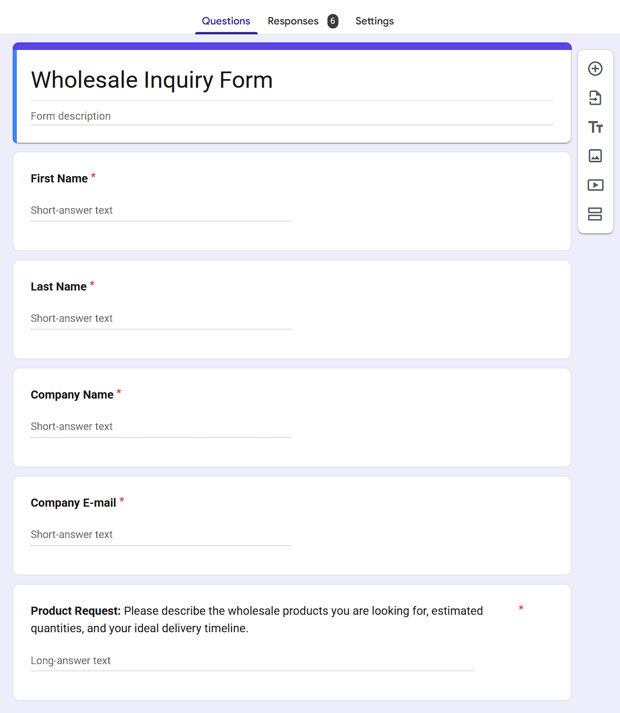
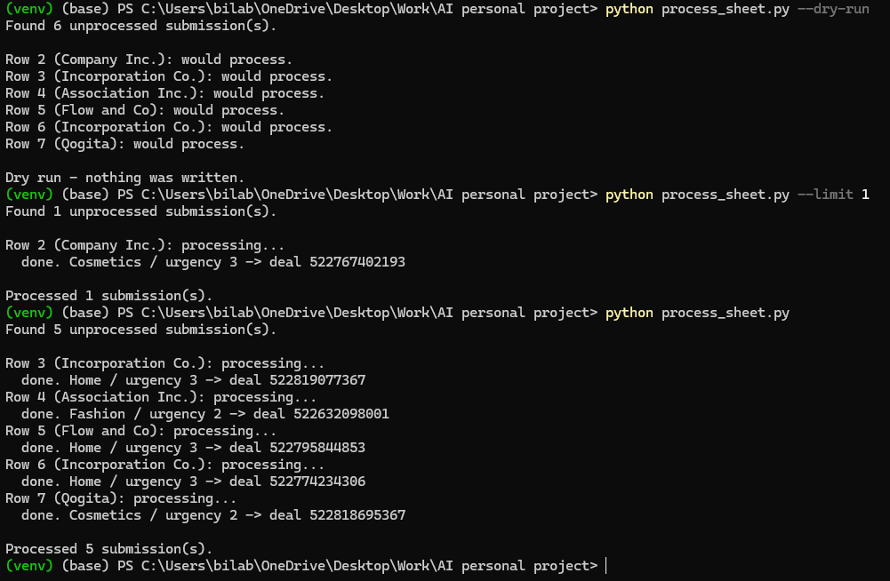
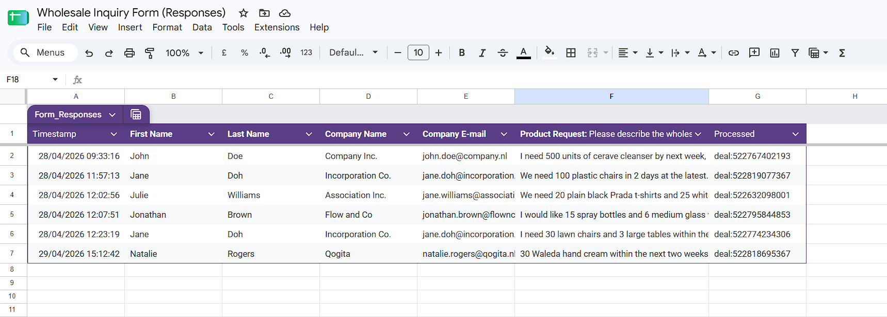
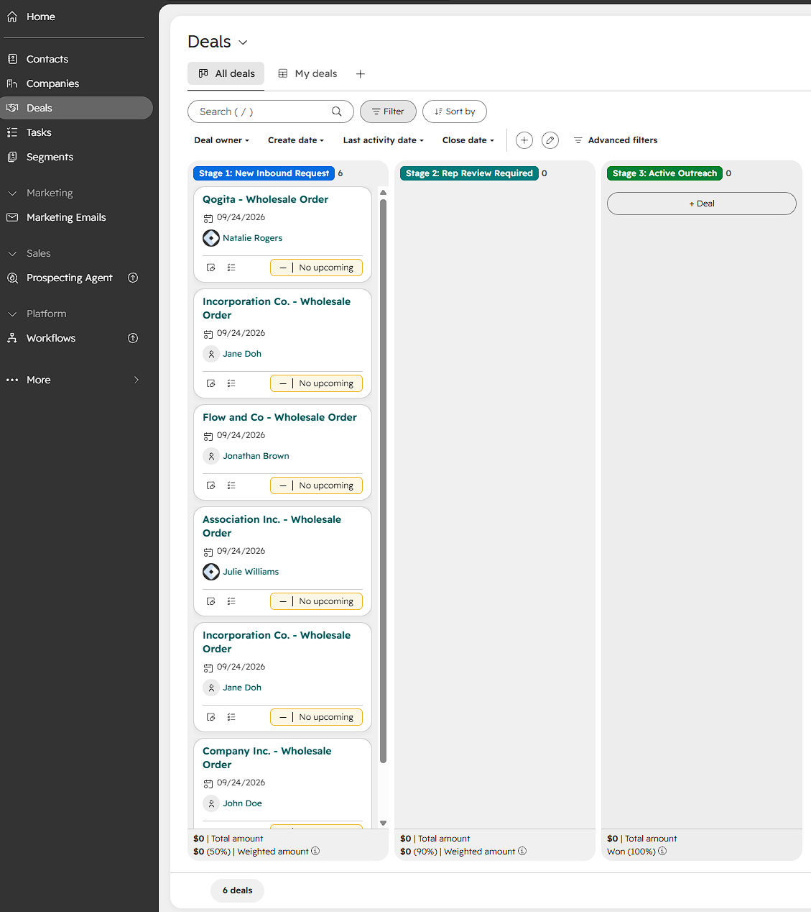

# Inbound Lead Enrichment Pipeline

Turns a free-text wholesale inquiry into a structured, triaged CRM record.

A buyer fills in a web form describing what they want in their own words. This
script sends that free text to Gemini, gets back a one-line summary, an urgency
tier and a product category, and writes a contact plus an associated deal into
HubSpot. A sales rep opens the deal board and sees a triaged request instead of
a wall of prose.

```
Google Form ──▶ responses sheet ──▶ Gemini 2.5 Flash ──▶ validate ──▶ HubSpot
                                     (structured JSON)             (contact + deal + association)
```

Two entry points:

- `process_sheet.py` reads the Google Forms responses sheet, processes every
  row that has not been handled yet, and marks it done. This is the end-to-end
  path.
- `enrich_lead.py` processes a single submission from a JSON file. Useful for
  testing the enrichment and CRM logic without involving Sheets.

## Why

Inbound wholesale inquiries arrive as unstructured text: "I need around 500
bluetooth speakers, ideally in three weeks." Someone has to read each one,
decide how urgent it is, work out which product line it belongs to, and type it
into the CRM. That is the step this removes.

## What it does

1. Reads a form submission (name, company, email, free-text product request).
2. Sends the free text to Gemini with a prompt constrained to return strict
   JSON: a one-sentence summary, an urgency tier of 1–3, and a category from a
   fixed list.
3. Validates and normalises that output before it touches the CRM.
4. Upserts the contact in HubSpot (updates instead of duplicating if the email
   already exists).
5. Creates a deal named after the company, carrying the summary, category and
   urgency as properties.
6. Associates the deal with the contact so both sides of the record link up.

## Design decisions worth calling out

**The prompt constrains the output space rather than asking nicely.** Category
comes from a fixed list, urgency is an explicit 1–3 tier with each level
defined, and the JSON shape is specified inline. Open-ended prompts produce
open-ended fields, and open-ended fields make a CRM unfilterable.

**Markdown fences get stripped explicitly.** Gemini wraps JSON in
` ```json ` blocks fairly often even when told not to, which breaks
`json.loads`. This was the most common failure mode when I first built this,
so it is handled rather than hoped away.

**Model output is validated before it is written.** An LLM will occasionally
return `"high"` instead of `3`, or invent a category outside the list. Anything
unrecognised falls back to a sane default instead of writing junk into the CRM,
because bad CRM data is far more expensive to clean up later than a wrong
default.

**Contacts are upserted, not created.** People submit forms twice. Creating
blindly would leave duplicate buyers.

**Sheet columns are matched by header text, not position.** Forms questions get
reordered and new ones get inserted. Matching on the header means that does not
silently shift every field by one.

**A failed row does not stop the batch, and is not marked processed.** One
malformed submission should not block the queue, and the next run retries it.

**Temperature is set to 0.** Identical submissions should classify identically.
Variety is not a virtue here.

## Setup

Requires Python 3.9 or newer.

```bash
git clone <your-repo-url>
cd inbound-lead-enrichment
python -m venv venv
source venv/bin/activate        # Windows: venv\Scripts\activate
pip install -r requirements.txt
cp .env.example .env            # then fill in your keys
```

You need two credentials in `.env`:

- `GEMINI_API_KEY` from [Google AI Studio](https://aistudio.google.com/apikey)
- `HUBSPOT_ACCESS_TOKEN` from a HubSpot private app with the
  `crm.objects.contacts.write` and `crm.objects.deals.write` scopes

### HubSpot custom properties

The script writes three custom properties that do not exist in a fresh HubSpot
account. Create them under Settings → Properties, on both the Contact and Deal
objects, with these internal names:

Contact object:

| Internal name          | Type             |
| ---------------------- | ---------------- |
| `ai_research_summary`  | Multi-line text  |
| `product_category_fit` | Dropdown select  |
| `urgency_tier`         | Dropdown select  |

Deal object:

| Internal name        | Type             |
| -------------------- | ---------------- |
| `order_summary`      | Multi-line text  |
| `product_category`   | Dropdown select  |
| `urgency_tier`       | Dropdown select  |

The two objects use different internal names for the same fields because the
properties were created separately as the account grew. Rather than hardcode
them inline, both sets live in the `CONTACT_PROPERTIES` and `DEAL_PROPERTIES`
mappings at the top of `enrich_lead.py`, so pointing this at a different portal
is a config change.

The category dropdowns need options matching the list in `CATEGORIES`
(including `General`, the fallback when the model returns something
unrecognised). The urgency dropdowns need options whose internal values are
`1`, `2` and `3`.

## Usage

End to end, from the form responses sheet:

```bash
python process_sheet.py --dry-run    # show which rows would be processed
python process_sheet.py              # process them
python process_sheet.py --limit 5    # process at most five
```

Single submission from a file:

```bash
python enrich_lead.py sample_submission.json --dry-run
python enrich_lead.py sample_submission.json
```

### Google Sheets access

`process_sheet.py` needs a Google service account with the Sheets API enabled.
Download its JSON key as `service_account.json` in the project root (it is
gitignored), then share the responses spreadsheet with the service account's
email address, giving it Editor access.

Add a column header called `Processed` in the first empty column of the
responses sheet. The script writes the created deal id there so the same
submission is never sent to HubSpot twice. Google Forms only appends to its own
columns, so this one is left alone.

## What I would do differently

- **Batch the writes.** One submission per run is fine for a demo but wasteful
  at volume; HubSpot's batch endpoints would cut the API calls substantially.
- **Add a confidence signal.** Right now a low-quality submission and a clear
  one produce equally confident output. Having the model flag its own
  uncertainty would let genuinely ambiguous requests route to a human.
- **Retry on transient failures.** There is no backoff; a rate limit or a
  network blip loses the submission.
- **Test against recorded fixtures.** The validation logic is the part most
  likely to break silently, and it is pure functions, so it is cheap to test.

## Background

This started as a no-code version built with Zapier as the connective tissue
between Google Forms, Gemini and HubSpot. This repository is that pipeline
rewritten as a single Python script with direct API calls, which removed the
dependency on paid Zapier features and made the error handling and validation
explicit rather than hidden in a no-code step.

## Screenshots








